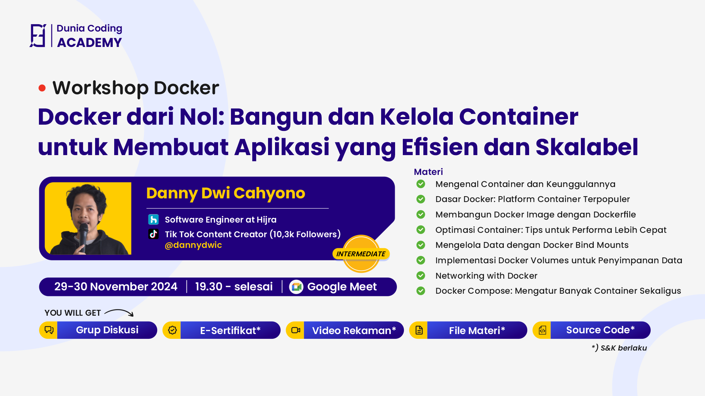

# 🚢 Docker Voyage Workshop

Welcome to the Docker Voyage Workshop! This hands-on workshop will take you on a journey through the world of containerization using Docker. Whether you're a beginner looking to understand container basics or a developer wanting to improve your Docker skills, this workshop provides practical exercises and real-world scenarios to help you master Docker.



## Branch Information

- `main` - Contains the complete, working code with finished Dockerfile and docker-compose configurations
- `develop` - Starter code branch where you'll need to create your own Dockerfile and docker-compose.yml files as part of the exercises

## Prerequisites

- Basic command line knowledge
- Git installed
- Docker Desktop installed
- Code editor (VS Code recommended)

## Getting Started

1. Clone the repository:

```bash
git clone https://github.com/dannycahyo/docker-voyage-workshop
cd docker-voyage-workshop
```

## Resources

- [Official Docker Documentation](https://docs.docker.com/)
- [Docker Hub](https://hub.docker.com/)

## Contributing

Feel free to open issues or submit pull requests for improvements.
